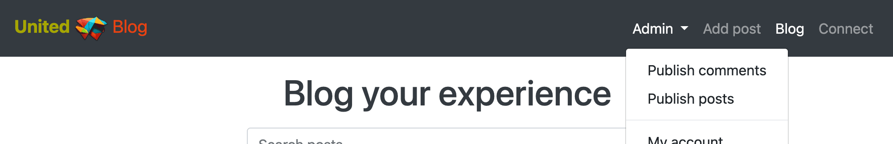

# **United**
United is a project for searching a partner for co-op game, earn tropyes and have fun finding a new friends! The site is divided into two blocks, *United | Blog* with posts and *United | Connect* with games, and offers a convenient search for finding games of interest to contact the author or an interesting post for discussion in the comments. All visitors can create their own user to start creating posts and game connects, comment on other authors posts, connect with other authors of game connects. All game connects, posts, and comments need approval by *United* staff members so everyone can feel safe from abuse, inappropriate language, etc. The approvals are being made from website UI pages that only is accessed by staff members. From a visual point of view the site has a clean look that makes navigation easy, and the freedom to design the posts and connections themselves remains with the user.

This website was created for Portfolio Project #4 - Diploma in Full Stack Software Development Diploma at the [Code Institute](https://www.codeinstitute.net).

[View live website here](https://www.uniteds.games/)

# Contents

* [**Project**](<#project>)
    * [Objective](<#objective>)
    
    * [Site Users Goal](<#site-users-goal>)
    
    * [Site Owners Goal](<#site-owners-goal>)
    
    * [Project Management](<#project-management>)

* [**User Experience (UX)**](<#user-experience-ux>)

    * [User Stories](<#user-stories>)

    * [Site Structure](<#site-structure>)

    * [Design Choices](<#design-choices>)

* [**Existing Features**](<#existing-features>)

    * [Navigation](<#navigation>)
    
    * [Blog](<#blog>)
    
    * [Connect](<#connect>)
    
    * [Account](<#account>)
    
    * [Social Account](<#social-account>)
    
    * [My Posts](<#my-posts>)
    
    * [My Games](<#my-games>)
    
    * [Post Detail View](<#post-detail-view>)
    
    * [Create Post](<#create-post>)
    
    * [Create Game Connect](<#create-game-connect>)
    
    * [Edit Post](<#edit-post>)
    
    * [Edit Game Connect](<#edit-game-connect>)
    
    * [Publish Posts](<#publish-posts>)
    
    * [Publish Connects](<#publish-connects>)
    
    * [Draft Post Detail View](<#draft-post-detail-view>)
    
    * [Draft Game Connect Detail View](<#draft-game-connect-detail-view>)
    
    * [Publish Post Confirmation](<#publish-post-confirmation>)
    
    * [Publish Game Connect Confirmation](<#publish-game-connect-confirmation>)
    
    * [Publish Comments](<#publish-comments>)
    
    * [Admin Page](<#admin-page>)
    
    * [Sign Up](<#sign-up>)
    
    * [Sign In](<#sign-in>)

    * [Sign Out](<#sign-out>)

    * [Footer](<#footer>)

    * [Flash Messages](<#flash-messages>)

* [**Features Left To Implement**](<#features-left-to-implement>)

* [**Technologies Used**](<#technologies-used>)

    * [Languages](<#languages>)

    * [Frameworks & Software](<#frameworks--software>)

    * [Libraries](<#libraries>)

* [**Testing**](<#testing>)

    * [Testing User Stories](<#testing-user-stories>)
    

# **Project**

## Objective
The idea of ​​creating this site came to me while looking for a partner to play together online to get the last trophy in one of the computer games. In the game itself, there is no auto-selection of a partner. And among my friends there are no gamers who are fond of the same game. I could not find a convenient tool with which to easily find a person to play together. The only option is to scroll through countless comment pages on old fashioned forums and send private messages to the commenters in the hope that they still have the game and the desire to win the trophy.

I also want to demonstrate my knowledge within the area of HTML, CSS, JavaScript, Python and the Django Framework.

## Site Users Goal
The user of 'United' loves gaming, to play together with others and to collect trophies, contributing with their knowledge to like minded. The user easily finds a partner in a game of interest and a post on a topic of interest.

## Site Owners Goal
The goal of the site owner is to deliver a site that the owner himself will use, where the users in an intuitive way can read about the games, contribute with their own posts, connect with new friends to play together. 

## Project Management

### Github Board
I've been using the project board in GitHub to keep my project together. It helped me structure up my work. GitHub was used to plan and organize my user stories.

<b>User Stories</b>

 

[Back to top](<#contents>)

### Database Schema
I've used a modelling tool called [Graph Models](https://django-extensions.readthedocs.io/en/latest/graph_models.html) to create the database schema. It shows the relationships between the different models in the database connected to the application. Graph Models exports a *.png file which visualize models.

Models used (besides standard user model) in this project are:

* **Post** - Handles all the posts in the blog application.
* **Comment** - Handles all the comments for posts in the blog application.
* **Game** - Handles all the games in the connect application.

<b>Database Schema Small</b>

 

<b>Database Schema Full</b>

 

# **User Experience (UX)**

## User Stories
Below the user stories for the project are listed to clarify why particular feature matters. These will then be tested and confirmed in the [Testing](<#testing>) section.

### Site User
|  | | |
|:-------:|:--------|:--------|
| As a Site User | I can view a list of posts so that I can select one to read | &check; |
| As a Site User | I can click on a post so that I can read the full text | &check; |
| As a Site User | I can view a paginated list of posts so that easily select a post to view | &check; |
| As a Site User | I can register an account so that I can comment and like | &check; |
| As a Site User | I can like or unlike a post so that I can interact with the content | &check; |
| As a Site User | I can view comments on an individual post so that I can read the conversation | &check; |
| As a Site User | I can leave comments on a post so that I can be involved in the conversation | &check; |
| As a Site User | I can view the number of likes on each post so that I can see which is the most popular or viral | &check; |
| As a Site User | I can add draft posts for the website UI so that staff member can approve it | &check; |
| As a Site User | I can see all my posts so that I knew which of them is published | &check; |
| As a Site User | I can search for posts so that I can filter posts that match my interests | &check; |
| As a Site User | I can view a list of connects so that I can select one to read | &check; |
| As a Site User | I can click on a connect so that I can read the full text | &check; |
| As a Site User | I can view a paginated list of connects so that easily select a connect to view | &check; |
| As a Site User | I can add draft connects for the website UI so that staff member can approve it | &check; |
| As a Site User | I can see all my connects so that I knew which of them is published | &check; |
| As a Site User | I can search for connects so that I can filter connects that match my interests | &check; |
| As a Site User | I can sign out from the site so that I can be safe that nobody can access my information | &check; |
| As a Site User | I can edit my login and email so that I can update up-to-date information about me | &check; |
| As a Site User | I can sign in / sign up with social account so that I can get access to all advantages of authenticated user faster | &check; |
| As a Site User | I can connect social account to my account so that I can login easily | &check; |

### Staff Member

|  | | |
|:-------:|:--------|:--------|
| As a Staff Member | I can view list of draft posts so that I can choose which post to publish | &check; |
| As a Staff Member | I can view list of draft connects so that I can choose which connect to publish | &check; |
| As a Staff Member | I can view list of draft comments so that I can choose which comment to publish | &check; |
| As a Staff Member | I can view/edit/delete/publish draft post so that I can secure high quality of the post content for the Site Users | &check; |
| As a Staff Member | I can view/edit/delete/publish draft connect so that I can secure high quality of the connect content for the Site Users | &check; |
| As a Staff Member | I can delete/publish draft comment so that I can secure a safe environment for the Site Users | &check; |

### Site Admin

|  | | |
|:-------:|:--------|:--------|
| As a Site Admin | I can approve or disapprove post comments so that I can filter out objectionable comments | &check; |
| As a Site Admin | I can create, read, update and delete posts so that I can manage my blog content | &check; |
| As a Site Admin | I can create, read, update and delete connects so that I can manage my connect content | &check; |
| As a Site Admin | I can create draft posts so that I can finish writing the content later | &check; |
| As a Site Admin | I can create draft connects so that I can finish writing the content later | &check; |
| As a Site Admin | I can access an admin page so that I can get a general understanding of signed up users, number of likes and number of posts | &check; |

[Back to top](<#contents>)

## Site Structure

The 'United' site is split up in two parts: **Blog** for **posts** and **Connect** for **game connects**.

The functionality is alo different **when the user is logged out** and **when the user is logged in**. Depending on login status different pages is available for the user. When the user is logged out the pages: *Sign In*, *Blog*, and *Connect* are avaliable. When the user is logged in: dropdown menu with username (*My account*, *My games* or/and *My posts*, *Sign Out*), *Add game* or *Add post*, *Blog*, and *Connect* are available. If you are logged in as an administrator or staff member an *admin area* is available: *Publish connects* or *Publish comments* with *Publish posts*. The site has an minimalistic, clean and intuitive design that makes the site easy to navigate for the user.

Read more about the different choices in the [Features](<#features>) section.

[Back to top](<#contents>)

## Design Choices

* ### Color Scheme

The color scheme chosen for the 'United' site is based on the Bootstrap 4.6 default colours. The colors are chosen in such a way that the background contrasts with the elements with which you can interact, the color of the buttons reflects their purpose, and the use of the functionality is as intuitive as possible. All colors are very clean and they create a professional look together and offers a good readability and contrast as well. I used the online service [Coolors](https://coolors.co/) to choose the color scheme.

* ### Typography
The fonts used for the site are the most popular fonts, depends on the operating system. Fallback font for all of them is sans-serif.

* "BlinkMacSystemFont": This is a system font specific to Apple devices, used by the Blink rendering engine on macOS.
* "Segoe UI": This is a font commonly used on Microsoft Windows systems.
* Roboto: This is a popular font developed by Google and commonly used in material design.
* "Helvetica Neue": This is a widely used font that is similar to Helvetica but introduced by Apple.
* Arial: This is a widely available font that is commonly used on both Windows and macOS.
* "Noto Sans": This is a font developed by Google that supports a wide range of scripts and languages.
* "Liberation Sans": This is a font designed to replace Arial on Linux systems.
* sans-serif: This is a generic font family that refers to a sans-serif font available on the system.

[Back to top](<#contents>)

# **Features**
The features of the site are listed below.

## **Existing Features**

### **Navigation**
The navigation bar is very clean and straight forward. Depending if you are logged in or not different menus are visible for the site user. An extra menu item is visible if you are logged in as an administrator / staff member.

*Links that are visible to logged out users*

* Sign In - Gives the user the opportunity to sign in or sign up if not ready a registered user at United.
* Blog - Lists all posts.
* Connect - Lists all game connects.

<b>Navigation Desktop - User Signed Out</b>

 

<b>Navigation Mobile - User Signed Out</b>

 

*Links that are visible to signed in users*

* Username dropdown list:
    * My account - Shows signed in users profile page.
    * My posts / My games - Lists all posts or game connects created by the logged in user depending on which section of the site the user is in.
    * Sign out - Logs out the user.
* Add post / Add game - Lets the user create a new post or game connect depending on which section of the site the user is in.
* Blog - Lists all posts.
* Connect - Lists all game connects.

<b>Navigation Desktop Blog - User Signed In</b>

 

<b>Navigation Desktop Connect - User Signed In</b>

 

<b>Navigation Mobile Blog - User Signed In</b>

 

<b>Navigation Mobile Connect - User Signed In</b>

 

*Link that is visible if user is administrator / staff member*

All of the links above plus the ones below.

* Blog section:
    * Publish comments - Lists all draft post comments to approve.
    * Publish posts - Lists all draft posts to approve.
* Connect section:
    * Publish games - Lists all draft g ame connects to approve.

<b>Navigation Desktop Blog - Admin / Staff Logged In</b>

 

<b>Navigation Desktop Connect - Admin / Staff Logged In</b>

 

<b>Navigation Mobile Blog - Admin / Staff Logged In</b>

 

<b>Navigation Mobile Connect - Admin / Staff Logged In</b>

 

### **Search**
The heart of this project is the search. This is a convenient way to search for game connects and posts of interest. It's available on the pages showing the list of games and posts (*Blog*, *My posts*, *Connect*, *My games* - for all users, and additionally *Publish posts* and *Publish games* - for administrator and staff member). The search does not require submission and refreshes output after each character input or deletion.

<b>Search</b>

 

### **Blog**
This page lists all the posts that has been made at United | Blog. For signed in and not signed in users this page looks the same. The page shows 12 cards before a pagination mechanism kicks in.

<b>Blog</b>

 

### **Connect**
This page lists all the game connects that has been made at United | Connect.

<b>Connect</b>

 

If the user is not signed in there is a sign in button in each open accordeon card view with the text: "Sign In to Connect or to Create a Connect".

<b>Connect - User Signed Out</b>

 

If the user is logged in a *Connect* option gets visible on the game connect open accordeon card view.

<b>Connect - User Signed In</b>

 

If the user is logged in is a author of the game connect: an *Edit* option gets visible at open accordeon card view.

<b>Connect - Author Signed In</b>

 

### **Account**
On this page the user can view and update their own username and email.

<b>Account</b>

 

### **Social Account**
On this page the user can add or remove 3rd party accounts (Google and GitHub).

<b>Social Account</b>

 

### **My Posts**
This page lists all the posts that has been made at United by signed in user. If the user is not logged in this page is forbidden. Here the user can see which of the posts have already been published and which are still avaiting approval.

<b>My Posts</b>

 

### **My Games**
This page lists all the game connects that has been made at United by signed in user. If the user is not logged in this page is forbidden. Here the user can see which of the game connects have already been published and which are still avaiting approval.

<b>My Games</b>

 

### **Post Detail View**
The post detail shows the details about the post that the user has chosen in the blog view. Depending on if the user is signed in and if the user is a post author the view looks a little bit different. If the user is logged in they get the possibility to like the post and also can see if it published and edit or delete it if they have written it. A signed in user can also leave a comment.

<b>Post Detail View - User Logged Out</b>

 

<b>Post Detail View - User Logged In</b>

 

<b>Post Detail View - Author Logged In</b>

 

### **Create Post**
On this page the registered and signed in user can create their own post. When they have created it in 'United' needs to approve it, until it's approved it will not be visible for the public.

<b>Create Post</b>

 

### **Create Game Connect**
On this page the registered and signed in user can create their own game connect. When they have created it in 'United' needs to approve it, until it's approved it will not be visible for the public.

<b>Create Game Connect</b>

 

### **Edit Post**
On this page the registered and logged in user can edit their own post. When they have updated it in 'United' needs to re-approve it, until it's re-approved it will not be visible for the public.

<b>Edit Post</b>

 

### **Edit Game Connect**
On this page the registered and logged in user can edit their own game connect. When they have updated it in 'United' needs to re-approve it, until it's re-approved it will not be visible for the public.

<b>Edit Game Connect</b>

 

### **Publish Posts**
This page lists all the draft posts avaiting approval that has been made at 'United' by signed in users. This page available only for administrator or staff member. If the user is not logged in this page is forbidden. Here the admin / staff member can choose the post to approve or delete.

<b>Publish Posts</b>

 

### **Publish Connects**
This page lists all the draft game connects avaiting approval that has been made at 'United' by signed in users. This page available only for administrator or staff member. If the user is not logged in this page is forbidden. Here the admin / staff member can choose the g ame connect to approve or delete.

<b>Publish Connects</b>

 

### **Draft Post Detail View**
The draft post detail shows the details about the draft post that the administrator / staff member has chosen in the publish posts view. Depending on if the administrator / staff member is a post author the view looks a little bit different. If the author of the post is a signed in admin / staff member, there will be no possibility to publish this post, only edit it.

<b>Draft Post Detail View</b>

 

<b>Draft Post Detail View - Admin / Staff member is Author</b>

 

### **Draft Game Connect Detail View**
The draft game connect detail shows the details about the draft game connect that the administrator / staff member has chosen in the publish connects view. Depending on if the administrator / staff member is a game connect author the view looks a little bit different. If the author of the game connect is a signed in admin / staff member, there will be no possibility to publish this game connect, only edit it.

<b>Draft Game Connect Detail View</b>

 

<b>Draft Game Connect Detail View - Admin / Staff member is Author</b>

 

### **Publish Post Confirmation**
On this page admin / staff member can edit draft post before publishing.

<b>Draft Post Publish Confirmation</b>

 

### **Publish Game Connect Confirmation**
On this page admin / staff member can edit draft game connect before publishing.

<b>Draft Game Connect Publish Confirmation</b>

 

### **Publish Comments**
This page lists all the draft comments avaiting approval that has been made at 'United' by signed in users. This page available only for administrator or staff member. If the user is not logged in this page is forbidden. Here the admin / staff member can approve or delete draft comments.

<b>Publish Comments</b>

 

### **Admin Page**
This page is available only by for superusers by url [/admin](https://www.uniteds.games/admin/). On this page the administrator (or other superuser decided by 'United') can *approve* / *delete* / *publish* / *unpublish* and *delete* posts, connects and comments. General information about *number of users*, *number of comments*, *number of posts*, *number of connects*, *unapproved comments / posts / connects* is also being showed on the page.

<b>Admin Page</b>

 

### **Sign Up**
If the site visitor has no registered user at 'United' they can sign up. They can also sign in with social account (Google or GitHub).

<b>Sign Up</b>

 

### **Sign In**
On this page the user can sign in to 'United'.

<b>Sign In</b>

 

### **Sign Out**
When the user clicks sign out in the dropdown menu a confirmation page is being showed so that the user don't accidently sign out.

<b>Sign Out</b>

 

### **Footer**
The footer area includes name of the creator and links to relevant resources.

<b>Footer</b>

 

### **Flash Messages**
The sites incorporates flash messages when an action has been performed (i.e. create/update/delete actions). Examples of this in the screenshots below.

<b>Confirmation Messages</b>

 

### Features Left to Implement

* Add automated testing
* Add comments to the game connect open accordeon view
* Add likes to the game connects
* Add ajax functionality to post likes
* Add ajax functionality to post comments
* Add likes functionality to the Blog view
* Add more 3rd party social account providers (Facebook, Twitter, etc)
* Add editing and deliting comments for comment authors

[Back to top](<#contents>)

# Technologies Used

## Languages

* [Python](https://en.wikipedia.org/wiki/Python_(programming_language)) - Provides the functionality for the site.
* [HTML5](https://en.wikipedia.org/wiki/HTML) - Provides the content and structure for the website.
* [CSS3](https://en.wikipedia.org/wiki/CSS) - Provides the styling for the website.
* [JavaScript](https://en.wikipedia.org/wiki/JavaScript) - Provides interactive elements of the website

## Frameworks & Software
* [Bootstrap](https://getbootstrap.com/) - A CSS framework that helps building solid, responsive, mobile-first sites
* [Django](https://www.djangoproject.com/) - A model-view-template framework used to create the Review | Alliance site
* [GitHub](https://github.com/) - Used to control versions of the website.
* [GitBash](https://en.wikipedia.org/wiki/Bash_(Unix_shell)) - Terminal used to push changes to the GitHub repository.
* [Heroku](https://en.wikipedia.org/wiki/Heroku) - A cloud platform that the application is deployed to.
* [Lighthouse](https://developer.chrome.com/docs/lighthouse/overview/) - Used to test performance of site.
* [Am I Responsive](https://ui.dev/amiresponsive/) - Used for responsiveness check.
* [Graph Models](https://django-extensions.readthedocs.io/en/latest/graph_models.html) - Used to create a *.png file of all models in the project.
* [Favicon](https://favicon.io/) - Used to create the favicon.
* [VSCode](https://code.visualstudio.com/) - Used to create and edit the site.
* [Google Chrome DevTools](https://developer.chrome.com/docs/devtools/) - Used to debug and test responsiveness.
* [Cloudinary](https://cloudinary.com/) - A service that hosts all static files in the project.
* [HTML Validation](https://validator.w3.org/) - Used to validate HTML code
* [CSS Validation](https://jigsaw.w3.org/css-validator/) - Used to validate CSS code
* [CI Python Linter](https://pep8ci.herokuapp.com/) - the PEP8 Online Validaton service form Codeinstitute.
* [JSHint Validation](https://jshint.com/) - Used to validate JavaScript code

[Back to top](<#contents>)

## Libraries

The libraries used in this project are located in the requirements.txt file and have been documented below

* [asgiref](https://pypi.org/project/asgiref/) - ASGI is a standard for Python asynchronous web apps and servers to communicate with each other, and positioned as an asynchronous successor to WSGI.
* [beautifulsoup4](https://pypi.org/project/beautifulsoup4/) - Beautiful Soup is a Python library for parsing HTML and XML documents. It provides easy methods for navigating, searching, and modifying the parsed data.
* [bleach](https://pypi.org/project/bleach/) - Bleach is a Django module that sanitizes HTML input, making it safe to display on a website to prevent cross-site scripting (XSS) attacks.
* [certifi](https://pypi.org/project/certifi/) - Certifi is a Python package that provides a curated collection of Root Certificates for validating the trustworthiness of SSL/TLS connections.
* [cffi](https://pypi.org/project/cffi/) - CFFI (C Foreign Function Interface) is a library for calling C functions from Python. It provides a way to interface with C code and create Python bindings for C libraries.
* [charset-normalizer](https://pypi.org/project/charset-normalizer/) - Charset Normalizer is a Python library that helps normalize and detect the character encoding of text. It provides functions to handle and convert text between different character encodings.
* [cloudinary](https://pypi.org/project/cloudinary/) - The Cloudinary Python SDK allows you to quickly and easily integrate your application with Cloudinary. Effortlessly optimize, transform, upload and manage your cloud's assets.
* [cryptography](https://pypi.org/project/cryptography/) - Cryptography is a Python library that provides cryptographic recipes and primitives. It includes support for various cryptographic algorithms, key generation, encryption, decryption, digital signatures, and more.
* [defusedxml](https://pypi.org/project/defusedxml/) - DefusedXML is a library that provides modified versions of the standard Python XML libraries to mitigate various security vulnerabilities. It helps protect against XML attacks such as entity expansion, external entity injection, and other XML parsing vulnerabilities.
* [dj-database-url](https://pypi.org/project/dj-database-url/) - Django Database URL is a Django module that allows you to utilize environment variables or a URL to configure your database settings. It provides a convenient way to manage and switch between different database configurations.
* [dj3-cloudinary-storage](https://pypi.org/project/dj3-cloudinary-storage/) - Django Cloudinary Storage is a Django package that facilitates integration with Cloudinary by implementing Django Storage API.
* [Django](https://pypi.org/project/Django/) - Django is a high-level Python web framework that encourages rapid development and clean, pragmatic design.
* [django-allauth](https://pypi.org/project/django-allauth/) - Integrated set of Django applications addressing authentication, registration, account management as well as 3rd party (social) account authentication.
* [django-crispy-forms](https://pypi.org/project/django-crispy-forms/) - Used to integrate Django DRY forms in the project.
* [django-extensions](https://pypi.org/project/django-extensions/) - Django Extensions is a collection of custom extensions for the Django Framework.
* [django-summernote](https://pypi.org/project/django-summernote/) - Django Summernote is a WYSIWYG text editor for Django. It integrates the Summernote editor into Django forms and provides a convenient way to edit rich text content.
* [gunicorn](https://pypi.org/project/gunicorn/) - Gunicorn ‘Green Unicorn’ is a Python WSGI HTTP Server for UNIX. It’s a pre-fork worker model ported from Ruby’s Unicorn project. The Gunicorn server is broadly compatible with various web frameworks, simply implemented, light on server resource usage, and fairly speedy.
* [idna](https://pypi.org/project/idna/) - IDNA (Internationalized Domain Names in Applications) is a Python library that provides support for working with internationalized domain names. It helps encode and decode domain names to and from ASCII-compatible encoding.
* [oauthlib](https://pypi.org/project/oauthlib/) - OAuthLib is a framework which implements the logic of OAuth1 or OAuth2 without assuming a specific HTTP request object or web framework.
* [psycopg2-binary](https://pypi.org/project/psycopg2-binary/) - Psycopg2 Binary is a PostgreSQL adapter for Python. It is a binary distribution of the psycopg2 library, which provides efficient and easy-to-use access to PostgreSQL databases from Python.
* [pycparser](https://pypi.org/project/pycparser/) - Pycparser is a pure Python parser for the C programming language. It allows parsing and analyzing C code from within Python, making it useful for various tasks such as code analysis, transformation, and generation.
* [PyJWT](https://pypi.org/project/PyJWT/) - A Python implementation of RFC 7519.
* [python3-openid](https://pypi.org/project/python3-openid/) - OpenID support for modern servers and consumers.
* [pytz](https://pypi.org/project/pytz/) - This is a set of Python packages to support use of the OpenID decentralized identity system in your application, update to Python 3.
* [requests](https://pypi.org/project/requests/) - Requests is a popular Python library for making HTTP requests. It provides a simple and intuitive interface for sending HTTP/1.1 requests, handling responses, and working with HTTP sessions.
* [requests-oauhlib](https://pypi.org/project/requests-oauthlib/) - Provides first-class OAuth library support for Requests.
* [six](https://pypi.org/project/six/) - Six is a Python module that provides a compatibility layer for bridging differences between Python 2 and Python 3. It allows developers to write code that works across both versions of Python.
* [soupsieve](https://pypi.org/project/soupsieve/) - Soupsieve is a CSS selector library for Python, specifically designed for use with Beautiful Soup. It allows you to filter and extract elements from HTML or XML documents using CSS selectors.
* [sqlparse](https://pypi.org/project/sqlparse/) - sqlparse is a non-validating SQL parser for Python. It provides support for parsing, splitting and formatting SQL statements.
* [urllib3](https://pypi.org/project/urllib3/) - Urllib3 is a powerful HTTP client library for Python. It provides a high-level interface for making HTTP requests, handling headers, cookies, redirects, and other aspects of the HTTP protocol.
* [webencodings](https://pypi.org/project/webencodings/) - Webencodings is a Python library that provides utilities for working with character encodings commonly used in web-related tasks. It includes functions for encoding and decoding HTML entities, URL encoding, and other web encoding formats.

[Back to top](<#contents>)

# Testing

## Testing User Stories

### Site User

|  |  |  |
|:-------:|:--------|:--------|
|  |  |  |
| As a Site User | I can view a list of posts so that I can select one to read | &check; |
|  | At the top of the site at the *Blog* page there is a navigation bar with a *Blog* link that lists all posts when the user clicks on it |  |
|  |  |  |
| As a Site User | I can click on a post so that I can read the full text | &check; |
|  | At the main section at the *Blog* page of the site there is a list of posts with links that opens post detail view when the user clicks on it |  |
|  |  |  |
| As a Site User | I can view a paginated list of posts so that easily select a post to view | &check; |
|  | On the *Blog* pages the pagination is activated when there are more than 12 posts on a page |  |
|  |  |  |
| As a Site User | I can register an account so that I can comment and like | &check; |
|  | In the navigation bar the user can click the *Sign In* link to either sign in or sign up for a new account. When this is done the user can interact on the page as stated in the user story |  |
|  |  |  |
| As a Site User | I can like or unlike a post so that I can interact with the content | &check; |
|  | When the user is signed in it is possible to click on a heart on the post detail page to like / unlike a post |  |
|  |  |  |
| As a Site User | I can view comments on an individual post so that I can read the conversation | &check; |
|  | When the user clicks on a specific post the comment section can be viewed |  |
|  |  |  |
| As a Site User | I can leave comments on a post so that I can be involved in the conversation | &check; |
|  | When the user is signed in, the comment can be submitted for review and, if everything is ok, the comment will be approved by the administrator or staff member. |  |
|  |  |  |
| As a Site User | I can view the number of likes on each post so that I can see which is the most popular or viral | &check; |
|  | On the post detail page the user can see how many likes the specific post has |  |
|  |  |  |
| As a Site User | I can add draft posts for the website UI so that staff member can approve it | &check; |
|  | In the navigation bar at the *Blog* page the user can click the *Add post* link when the user is signed in. The user can create a post and submit it for review |  |
|  |  |  |
| As a Site User | I can see all my posts so that I knew which of them is published | &check; |
|  | In the navigation bar at the *Blog* page the user can click the *My posts* link when the user is signed in. The user will see all their posts with a sign is it published or awaiting approval |  |
|  |  |  |
| As a Site User | I can search for posts so that I can filter posts that match my interests | &check; |
|  | The user can focus on search input at the top of the pages: *Blog*, *My posts*. When entering characters, posts will be filtered according to the user's request without the need to submit |  |
|  |  |  |
| As a Site User | I can view a list of connects so that I can select one to read | &check; |
|  | At the top of the site at the *Connect* page there is a navigation bar with a *Connect* link that lists all game connects when the user clicks on it |  |
|  |  |  |
| As a Site User | I can click on a connect so that I can read the full text | &check; |
|  | At the main section at the *Connect* page of the site there is a list of game connects as an accordeon that opens game connect full view when the user clicks on it |  |
|  |  |  |
| As a Site User | I can view a paginated list of connects so that easily select a connect to view | &check; |
|  | On the *Connect* pages the pagination is activated when there are more than 10 game connects on a page |  |
|  |  |  |
| As a Site User | I can add draft connects for the website UI so that staff member can approve it | &check; |
|  | In the navigation bar at the *Connect* page the user can click the *Add game* link when the user is signed in. The user can create a connect and submit it for review |  |
|  |  |  |
| As a Site User | I can see all my connects so that I knew which of them is published | &check; |
|  | In the navigation bar at the *Connect* page the user can click the *My games* link when the user is signed in. The user will see all their game connects with a sign is it published or awaiting approval |  |
|  |  |  |
| As a Site User | I can search for connects so that I can filter connects that match my interests | &check; |
|  | The user can focus on search input at the top of the pages: *Connect*, *My games*. When entering characters, game connects will be filtered according to the user's request without the need to submit |  |
|  |  |  |
| As a Site User | I can sign out from the site so that I can be safe that nobody can access my information | &check; |
|  | When the user is signed in it is possible to choose the *Sign Out*-option in the navigation menu |  |
|  |  |  |
| As a Site User | I can edit my login and email so that I can update up-to-date information about me | &check; |
|  | When the user is signed in it is possible to choose the *My account* link in the navigation menu. The user will see their account page with prepopulated inputs of login and email. The user can change it and save |  |
|  |  |  |
| As a Site User | I can sign in / sign up with social account so that I can get access to all advantages of authenticated user faster | &check; |
|  | When the user is signed out it is possible to choose the 3rd party social account links 'Google' and 'GitHub' to sign at both *Sign In* and *Sign Up* pages. The user will be redirected to appropriate website to sign in |  |
|  |  |  |
| As a Site User | I can connect social account to my account so that I can login easily | &check; |
|  | When the user is signed in it is possible to choose the *My account* link in the navigation menu. The user will see their account page with prepopulated inputs of login and email. The user can click at 'Connect or remove Social Account' to add /remove 3rd party social account |  |
|  |  |  |

### Staff Member

|  |  |  |
|:-------:|:--------|:--------|
| As a Staff Member | I can view list of draft posts so that I can choose which post to publish | &check; |
|  | At the top of the site at the *Blog* page there is a navigation bar with a *Publish posts* link in the dropdown menu that lists all draft posts when the staff member clicks on it |  |
|  |  |  |
| As a Staff Member | I can view list of draft connects so that I can choose which connect to publish | &check; |
|  | At the top of the site at the *Connect* page there is a navigation bar with a *Publish games* link in the dropdown menu that lists all draft game connects when the staff member clicks on it |  |
|  |  |  |
| As a Staff Member | I can view list of draft comments so that I can choose which comment to publish | &check; |
|  | At the top of the site at the *Blog* page there is a navigation bar with a *Publish comments* link in the dropdown menu that lists all draft comments when the staff member clicks on it |  |
|  |  |  |
| As a Staff Member | I can view/edit/delete/publish draft post so that I can secure high quality of the post content for the Site Users | &check; |
|  | At the *Publish posts* view staff member can choose post to review, open post detail view, edit it, click *Publish* to publish this post. or *Delete* to delete this post |  |
|  |  |  |
| As a Staff Member | I can view/edit/delete/publish draft connect so that I can secure high quality of the connect content for the Site Users | &check; |
|  | At the *Publish games* view staff member can choose game connect to review, open game connect edit view, edit it, click *Publish* to publish this game connect. or *Delete* to delete this game connect |  |
|  |  |  |
| As a Staff Member | I can delete/publish draft comment so that I can secure a safe environment for the Site Users | &check; |
|  | At the top of the site at the *Blog* page there is a navigation bar with a *Publish comments* link in the dropdown menu that lists all draft comments when the staff member clicks on it. The staff member can then publish or delete each draft comment |  |
|  |  |  |

### Site Admin

|  |  |  |
|:-------:|:--------|:--------|
| As a Site Admin | I can approve or disapprove post comments so that I can filter out objectionable comments | &check; |
|  | At the top of the site at the *Blog* page there is a navigation bar with a *Publish comments* link in the dropdown menu that lists all draft comments when the admin clicks on it. The admin can then publish or delete each draft comment |  |
|  |  |  |
| As a Site Admin | I can create, read, update and delete posts so that I can manage my blog content | &check; |
|  | When the user is logged in as an administrator they can access url [/admin](https://www.uniteds.games/admin/) page there they can create, read, update and delete posts |  |
|  |  |  |
| As a Site Admin | I can create, read, update and delete connects so that I can manage my connect content | &check; |
|  | When the user is logged in as an administrator they can access url [/admin](https://www.uniteds.games/admin/) page there they can create, read, update and delete game connects |  |
|  |  |  |
| As a Site Admin | I can create draft posts so that I can finish writing the content later | &check; |
|  | When the user is logged in as an administrator they can access url [/admin](https://www.uniteds.games/admin/) page there they can create draft posts |  |
|  |  |  |
| As a Site Admin | I can create draft connects so that I can finish writing the content later | &check; |
|  | When the user is logged in as an administrator they can access url [/admin](https://www.uniteds.games/admin/) page there they can create draft game connects |  |
|  |  |  |
| As a Site Admin | I can access an admin page so that I can get a general understanding of signed up users, number of likes and number of posts and game connects | &check; |
|  | When the user is logged in as an administrator they can access url [/admin](https://www.uniteds.games/admin/) page there they can get a general understanding of signed up users, number of likes and number of posts and game connects |  |
|  |  |  |

[Back to top](<#contents>)
