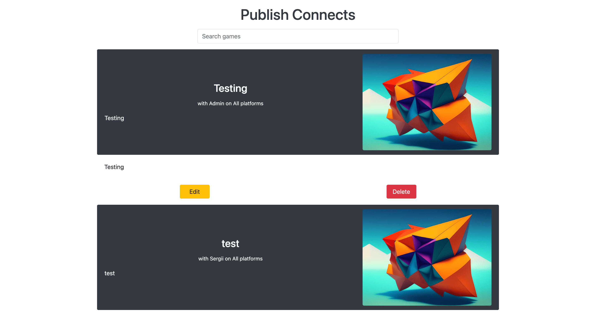
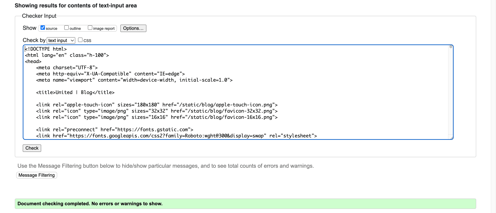
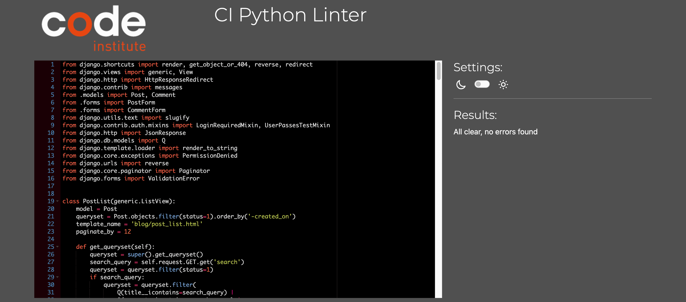
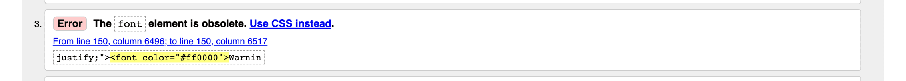
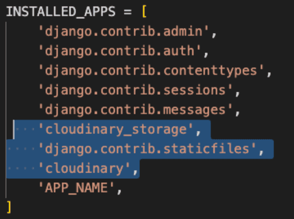

# **United**
United is a project for searching a partner for co-op game, earn tropyes and have fun finding a new friends! The site is divided into two blocks, *United | Blog* with posts and *United | Connect* with games, and offers a convenient search for finding games of interest to contact the author or an interesting post for discussion in the comments. All visitors can create their own user to start creating posts and game connects, comment on other authors posts, connect with other authors of game connects. All game connects, posts, and comments need approval by *United* staff members so everyone can feel safe from abuse, inappropriate language, etc. The approvals are being made from website UI pages that only is accessed by staff members. From a visual point of view the site has a clean look that makes navigation easy, and the freedom to design the posts and connections themselves remains with the user.

This website was created for Portfolio Project #4 - Diploma in Full Stack Software Development Diploma at the [Code Institute](https://www.codeinstitute.net).

[View live website here](https://www.uniteds.games/)


# Contents

* [**Project**](<#project>)

    * [Objective](<#objective>)
    
    * [Site Users Goal](<#site-users-goal>)
    
    * [Site Owners Goal](<#site-owners-goal>)
    
    * [Project Management](<#project-management>)

* [**User Experience (UX)**](<#user-experience-ux>)

    * [User Stories](<#user-stories>)

    * [Site Structure](<#site-structure>)

    * [Design Choices](<#design-choices>)

* [**Existing Features**](<#existing-features>)

    * [Navigation](<#navigation>)
    
    * [Blog](<#blog>)
    
    * [Connect](<#connect>)
    
    * [Account](<#account>)
    
    * [Social Account](<#social-account>)
    
    * [My Posts](<#my-posts>)
    
    * [My Games](<#my-games>)
    
    * [Post Detail View](<#post-detail-view>)
    
    * [Create Post](<#create-post>)
    
    * [Create Game Connect](<#create-game-connect>)
    
    * [Edit Post](<#edit-post>)
    
    * [Edit Game Connect](<#edit-game-connect>)
    
    * [Publish Posts](<#publish-posts>)
    
    * [Publish Connects](<#publish-connects>)
    
    * [Draft Post Detail View](<#draft-post-detail-view>)
    
    * [Draft Game Connect Detail View](<#draft-game-connect-detail-view>)
    
    * [Publish Post Confirmation](<#publish-post-confirmation>)
    
    * [Publish Game Connect Confirmation](<#publish-game-connect-confirmation>)
    
    * [Publish Comments](<#publish-comments>)
    
    * [Admin Page](<#admin-page>)
    
    * [Sign Up](<#sign-up>)
    
    * [Sign In](<#sign-in>)

    * [Sign Out](<#sign-out>)

    * [Footer](<#footer>)

    * [Flash Messages](<#flash-messages>)

* [**Features Left To Implement**](<#features-left-to-implement>)

* [**Technologies Used**](<#technologies-used>)

    * [Languages](<#languages>)

    * [Frameworks & Software](<#frameworks--software>)

    * [Libraries](<#libraries>)

* [**Testing**](<#testing>)

    * [Testing User Stories](<#testing-user-stories>)

    * [Code Validation](<#code-validation>)
    
    * [Manual Testing](<#manual-testing>)
    
    * [Responsiveness Test](<#responsiveness-test>)
    
    * [Browser Compatibility](<#browser-compatibility>)
    
    * [Lighthouse](<#lighthouse>)
    
    * [Peer Review](<#peer-review>)

    * [Known Bugs](<#known-bugs>)

* [Deployment](<#deployment>)

    * [Deployment To Heroku](<#deployment-to-heroku>)

    * [Domain connection](<#domain-connection>)

    * [Update SSL certificate](<#update-ssl-certificate>)

    * [Forking The Repository On GitHub](<#forking-the-repository-on-github>)

    * [Cloning And Setting Up This Project](<#cloning-and-setting-up-this-project>)

* [Credits](<#credits>)

* [Acknowledgements](<#acknowledgements>)

# **Project**

## Objective
The idea of ​​creating this site came to me while looking for a partner to play together online to get the last trophy in one of the computer games. In the game itself, there is no auto-selection of a partner. And among my friends there are no gamers who are fond of the same game. I could not find a convenient tool with which to easily find a person to play together. The only option is to scroll through countless comment pages on old fashioned forums and send private messages to the commenters in the hope that they still have the game and the desire to win the trophy.

I also want to demonstrate my knowledge within the area of HTML, CSS, JavaScript, Python and the Django Framework.

## Site Users Goal
The user of 'United' loves gaming, to play together with others and to collect trophies, contributing with their knowledge to like minded. The user easily finds a partner in a game of interest and a post on a topic of interest.

## Site Owners Goal
The goal of the site owner is to deliver a site that the owner himself will use, where the users in an intuitive way can read about the games, contribute with their own posts, connect with new friends to play together. 

## Project Management

### Github Board
I've been using the project board in GitHub to keep my project together. It helped me structure up my work. GitHub was used to plan and organize my user stories.

<details><summary><b>User Stories</b></summary>


</details><br/>

[Back to top](<#contents>)

### Database Schema
I've used a modelling tool called [Graph Models](https://django-extensions.readthedocs.io/en/latest/graph_models.html) to create the database schema. It shows the relationships between the different models in the database connected to the application. Graph Models exports a *.png file which visualize models.

Models used (besides standard user model) in this project are:

* **Post** - Handles all the posts in the blog application.
* **Comment** - Handles all the comments for posts in the blog application.
* **Game** - Handles all the games in the connect application.

<details><summary><b>Database Schema Small</b></summary>


</details><br/>

<details><summary><b>Database Schema Full</b></summary>


</details><br/>

# **User Experience (UX)**

## User Stories
Below the user stories for the project are listed to clarify why particular feature matters. These will then be tested and confirmed in the [Testing](<#testing>) section.

### Site User

| Role | Case |  |
|:-------:|:--------|:--------|
| As a Site User | I can view a list of posts so that I can select one to read | &check; |
| As a Site User | I can click on a post so that I can read the full text | &check; |
| As a Site User | I can view a paginated list of posts so that easily select a post to view | &check; |
| As a Site User | I can register an account so that I can comment and like | &check; |
| As a Site User | I can like or unlike a post so that I can interact with the content | &check; |
| As a Site User | I can view comments on an individual post so that I can read the conversation | &check; |
| As a Site User | I can leave comments on a post so that I can be involved in the conversation | &check; |
| As a Site User | I can view the number of likes on each post so that I can see which is the most popular or viral | &check; |
| As a Site User | I can add draft posts for the website UI so that staff member can approve it | &check; |
| As a Site User | I can see all my posts so that I knew which of them is published | &check; |
| As a Site User | I can search for posts so that I can filter posts that match my interests | &check; |
| As a Site User | I can view a list of connects so that I can select one to read | &check; |
| As a Site User | I can click on a connect so that I can read the full text | &check; |
| As a Site User | I can view a paginated list of connects so that easily select a connect to view | &check; |
| As a Site User | I can add draft connects for the website UI so that staff member can approve it | &check; |
| As a Site User | I can see all my connects so that I knew which of them is published | &check; |
| As a Site User | I can search for connects so that I can filter connects that match my interests | &check; |
| As a Site User | I can flip paginated pages after the search so that I can find item from search result manually | &check; |
| As a Site User | I can visit game connect form and submit it so that I can email game connect author | &check; |
| As a Site User | I can sign out from the site so that I can be safe that nobody can access my information | &check; |
| As a Site User | I can edit my login and email so that I can update up-to-date information about me | &check; |
| As a Site User | I can sign in / sign up with social account so that I can get access to all advantages of authenticated user faster | &check; |
| As a Site User | I can connect social account to my account so that I can login easily | &check; |

### Staff Member

| Role | Case |  |
|:-------:|:--------|:--------|
| As a Staff Member | I can view list of draft posts so that I can choose which post to publish | &check; |
| As a Staff Member | I can view list of draft connects so that I can choose which connect to publish | &check; |
| As a Staff Member | I can view list of draft comments so that I can choose which comment to publish | &check; |
| As a Staff Member | I can view/edit/delete/publish draft post so that I can secure high quality of the post content for the Site Users | &check; |
| As a Staff Member | I can view/edit/delete/publish draft connect so that I can secure high quality of the connect content for the Site Users | &check; |
| As a Staff Member | I can delete/publish draft comment so that I can secure a safe environment for the Site Users | &check; |

### Site Admin

| Role | Case |  |
|:-------:|:--------|:--------|
| As a Site Admin | I can approve or disapprove post comments so that I can filter out objectionable comments | &check; |
| As a Site Admin | I can create, read, update and delete posts so that I can manage my blog content | &check; |
| As a Site Admin | I can create, read, update and delete connects so that I can manage my connect content | &check; |
| As a Site Admin | I can create draft posts so that I can finish writing the content later | &check; |
| As a Site Admin | I can create draft connects so that I can finish writing the content later | &check; |
| As a Site Admin | I can access an admin page so that I can get a general understanding of signed up users, number of likes and number of posts | &check; |

[Back to top](<#contents>)

## Site Structure

The 'United' site is split up in three parts: **Blog** for **posts**, **Connect** for **game connects**, and **Account** for **profile details**.

The functionality is alo different **when the user is signed out** and **when the user is signed in**. Depending on login status different pages is available for the user. When the user is signed out the pages: *Sign In*, *Blog*, and *Connect* are avaliable. When the user is signed in: dropdown menu with username (*My account*, *My games* or/and *My posts*, *Sign Out*), *Add game* or *Add post*, *Blog*, and *Connect* are available. If you are signed in as an administrator or staff member an *admin area* is available: *Publish connects* or *Publish comments* with *Publish posts*. The site has an minimalistic, clean and intuitive design that makes the site easy to navigate for the user.

Read more about the different choices in the [Features](<#features>) section.

[Back to top](<#contents>)

## Design Choices

* ### Color Scheme

The color scheme chosen for the 'United' site is based on the Bootstrap 4.6 default colours. The colors are chosen in such a way that the background contrasts with the elements with which you can interact, the color of the buttons reflects their purpose, and the use of the functionality is as intuitive as possible. All colors are very clean and they create a professional look together and offers a good readability and contrast as well. I used the online service [Coolors](https://coolors.co/) to choose the color scheme.


* ### Typography
The fonts used for the site are the most popular fonts, depends on the operating system. Fallback font for all of them is sans-serif.

* "BlinkMacSystemFont": This is a system font specific to Apple devices, used by the Blink rendering engine on macOS.
* "Segoe UI": This is a font commonly used on Microsoft Windows systems.
* Roboto: This is a popular font developed by Google and commonly used in material design.
* "Helvetica Neue": This is a widely used font that is similar to Helvetica but introduced by Apple.
* Arial: This is a widely available font that is commonly used on both Windows and macOS.
* "Noto Sans": This is a font developed by Google that supports a wide range of scripts and languages.
* "Liberation Sans": This is a font designed to replace Arial on Linux systems.
* sans-serif: This is a generic font family that refers to a sans-serif font available on the system.

[Back to top](<#contents>)

# **Features**
The features of the site are listed below.

## **Existing Features**

### **Navigation**
The navigation bar is very clean and straight forward. Depending if you are signed in or not different menus are visible for the site user. An extra menu item is visible if you are signed in as an administrator / staff member.

*Links that are visible to signed out users*

* Sign In - Gives the user the opportunity to sign in or sign up if not ready a registered user at United.
* Blog - Lists all posts.
* Connect - Lists all game connects.

<details><summary><b>Navigation Desktop - User Signed Out</b></summary>


</details><br/>

<details><summary><b>Navigation Mobile - User Signed Out</b></summary>


</details><br/>

*Links that are visible to signed in users*

* Username dropdown list:
    * My account - Shows signed in users profile page.
    * My posts / My games - Lists all posts or game connects created by the signed in user depending on which section of the site the user is in.
    * Sign out - Logs out the user.
* Add post / Add game - Lets the user create a new post or game connect depending on which section of the site the user is in.
* Blog - Lists all posts.
* Connect - Lists all game connects.

<details><summary><b>Navigation Desktop Blog - User Signed In</b></summary>


</details><br/>

<details><summary><b>Navigation Desktop Connect - User Signed In</b></summary>


</details><br/>

<details><summary><b>Navigation Mobile Blog - User Signed In</b></summary>


</details><br/>

<details><summary><b>Navigation Mobile Connect - User Signed In</b></summary>


</details><br/>

*Link that is visible if user is administrator / staff member*

All of the links above plus the ones below.

* Blog section:
    * Publish comments - Lists all draft post comments to approve.
    * Publish posts - Lists all draft posts to approve.
* Connect section:
    * Publish games - Lists all draft g ame connects to approve.

<details><summary><b>Navigation Desktop Blog - Admin / Staff signed In</b></summary>


</details><br/>

<details><summary><b>Navigation Desktop Connect - Admin / Staff signed In</b></summary>


</details><br/>

<details><summary><b>Navigation Mobile Blog - Admin / Staff signed In</b></summary>


</details><br/>

<details><summary><b>Navigation Mobile Connect - Admin / Staff signed In</b></summary>


</details><br/>

### **Search**
The heart of this project is the search. This is a convenient way to search for game connects and posts of interest. It's available on the pages showing the list of games and posts (*Blog*, *My posts*, *Connect*, *My games* - for all users, and additionally *Publish posts* and *Publish games* - for administrator and staff member). The search does not require submission and refreshes output after each character input or deletion.

<details><summary><b>Search</b></summary>


</details><br/>

### **Pagination**
Pagination has buttons: *previous page*, *first page*, *page numbers (previous, current, and next)*, *last page*, and *next page*. Pagination takes into account search results and when turning pages, only the page corresponding to the search results is flipped.

<details><summary><b>Search</b></summary>


</details><br/>

### **Blog**
This page lists all the posts that has been made at United | Blog. For signed in and not signed in users this page looks the same. The page shows 12 cards before a pagination mechanism kicks in.

<details><summary><b>Blog</b></summary>


</details><br/>

### **Connect**
This page lists all the game connects that has been made at United | Connect.

<details><summary><b>Connect</b></summary>


</details><br/>

If the user is not signed in there is a sign in button in each open accordeon card view with the text: "Sign In to Connect or to Create a Connect".

<details><summary><b>Connect - User Signed Out</b></summary>


</details><br/>

If the user is signed in a *Connect* option gets visible on the game connect open accordeon card view.

<details><summary><b>Connect - User Signed In</b></summary>


</details><br/>

If the user is signed in as an author of the game connect: an *Edit* option gets visible at open accordeon card view.

<details><summary><b>Connect - Author Signed In</b></summary>


</details><br/>

### **Connect with Author**

If the user is signed in a *Connect* button allows to get to the *Connect with Author* page. Submitting the form user is sending email to the game connect author.

<details><summary><b>Connect with Author - Form</b></summary>


</details><br/>

<details><summary><b>Connect with Author - Email example</b></summary>


</details><br/>

By clicking 'Reply' in the mail service game connect author can reply to the user.

### **Account**
On this page the user can view and update their own username and email.

<details><summary><b>Account</b></summary>


</details><br/>

### **Social Account**
On this page the user can add or remove 3rd party accounts (Google and GitHub).

<details><summary><b>Social Account</b></summary>


</details><br/>

### **My Posts**
This page lists all the posts that has been made at United by signed in user. If the user is not signed in this page is forbidden. Here the user can see which of the posts have already been published and which are still avaiting approval.

<details><summary><b>My Posts</b></summary>


</details><br/>

### **My Games**
This page lists all the game connects that has been made at United by signed in user. If the user is not signed in this page is forbidden. Here the user can see which of the game connects have already been published and which are still avaiting approval.

<details><summary><b>My Games</b></summary>


</details><br/>

### **Post Detail View**
The post detail shows the details about the post that the user has chosen in the blog view. Depending on if the user is signed in and if the user is a post author the view looks a little bit different. If the user is signed in they get the possibility to like the post and also can see if it published and edit or delete it if they have written it. A signed in user can also leave a comment.

<details><summary><b>Post Detail View - User Signed Out</b></summary>


</details><br/>

<details><summary><b>Post Detail View - User Signed In</b></summary>


</details><br/>

<details><summary><b>Post Detail View - Author Signed In</b></summary>


</details><br/>

### **Create Post**
On this page the registered and signed in user can create their own post. When they have created it in 'United' needs to approve it, until it's approved it will not be visible for the public.

<details><summary><b>Create Post</b></summary>


</details><br/>

### **Create Game Connect**
On this page the registered and signed in user can create their own game connect. When they have created it in 'United' needs to approve it, until it's approved it will not be visible for the public.

<details><summary><b>Create Game Connect</b></summary>


</details><br/>

### **Edit Post**
On this page the registered and signed in user can edit their own post. When they have updated it in 'United' needs to re-approve it, until it's re-approved it will not be visible for the public.

<details><summary><b>Edit Post</b></summary>


</details><br/>

### **Edit Game Connect**
On this page the registered and signed in user can edit their own game connect. When they have updated it in 'United' needs to re-approve it, until it's re-approved it will not be visible for the public.

<details><summary><b>Edit Game Connect</b></summary>


</details><br/>

### **Publish Posts**
This page lists all the draft posts avaiting approval that has been made at 'United' by signed in users. This page available only for administrator or staff member. If the user is not signed in this page is forbidden. Here the admin / staff member can choose the post to approve or delete.

<details><summary><b>Publish Posts</b></summary>


</details><br/>

### **Publish Connects**
This page lists all the draft game connects avaiting approval that has been made at 'United' by signed in users. This page available only for administrator or staff member. If the user is not signed in this page is forbidden. Here the admin / staff member can choose the g ame connect to approve or delete.

<details><summary><b>Publish Connects</b></summary>


</details><br/>

### **Draft Post Detail View**
The draft post detail shows the details about the draft post that the administrator / staff member has chosen in the publish posts view. Depending on if the administrator / staff member is a post author the view looks a little bit different. If the author of the post is a signed in admin / staff member, there will be no possibility to publish this post, only edit it.

<details><summary><b>Draft Post Detail View</b></summary>


</details><br/>

<details><summary><b>Draft Post Detail View - Admin / Staff member is Author</b></summary>


</details><br/>

### **Draft Game Connect Detail View**
The draft game connect detail shows the details about the draft game connect that the administrator / staff member has chosen in the publish connects view. Depending on if the administrator / staff member is a game connect author the view looks a little bit different. If the author of the game connect is a signed in admin / staff member, there will be no possibility to publish this game connect, only edit it.

<details><summary><b>Draft Game Connect Detail View</b></summary>


</details><br/>

<details><summary><b>Draft Game Connect Detail View - Admin / Staff member is Author</b></summary>


</details><br/>

### **Publish Post Confirmation**
On this page admin / staff member can edit draft post before publishing.

<details><summary><b>Draft Post Publish Confirmation</b></summary>


</details><br/>

### **Publish Game Connect Confirmation**
On this page admin / staff member can edit draft game connect before publishing.

<details><summary><b>Draft Game Connect Publish Confirmation</b></summary>


</details><br/>

### **Publish Comments**
This page lists all the draft comments avaiting approval that has been made at 'United' by signed in users. This page available only for administrator or staff member. If the user is not signed in this page is forbidden. Here the admin / staff member can approve or delete draft comments.

<details><summary><b>Publish Comments</b></summary>


</details><br/>

### **Admin Page**
This page is available only by for superusers by url [/admin](https://www.uniteds.games/admin/). On this page the administrator (or other superuser decided by 'United') can *approve* / *delete* / *publish* / *unpublish* and *delete* posts, connects and comments. General information about *number of users*, *number of comments*, *number of posts*, *number of connects*, *unapproved comments / posts / connects* is also being showed on the page.

<details><summary><b>Admin Page</b></summary>


</details><br/>

### **Sign Up**
If the site visitor has no registered user at 'United' they can sign up. They can also sign in with social account (Google or GitHub).

<details><summary><b>Sign Up</b></summary>


</details><br/>

### **Sign In**
On this page the user can sign in to 'United'.

<details><summary><b>Sign In</b></summary>


</details><br/>

### **Sign Out**
When the user clicks sign out in the dropdown menu a confirmation page is being showed so that the user don't accidently sign out.

<details><summary><b>Sign Out</b></summary>


</details><br/>

### **Footer**
The footer area includes name of the creator and links to relevant resources.

<details><summary><b>Footer</b></summary>


</details><br/>

### **Flash Messages**
The sites incorporates flash messages when an action has been performed (i.e. create/update/delete actions). Examples of this in the screenshots below.

<details><summary><b>Confirmation Messages</b></summary>


</details><br/>

### Features Left to Implement

* Add automated testing
* Add comments to the game connect open accordeon view
* Add likes to the game connects
* Add ajax functionality to post likes
* Add ajax functionality to post comments
* Add likes functionality to the Blog view
* Add more 3rd party social account providers (Facebook, Twitter, etc)
* Add editing and deliting comments for comment authors

[Back to top](<#contents>)

# Technologies Used

## Languages

* [Python](https://en.wikipedia.org/wiki/Python_(programming_language)) - Provides the functionality for the site.
* [HTML5](https://en.wikipedia.org/wiki/HTML) - Provides the content and structure for the website.
* [CSS3](https://en.wikipedia.org/wiki/CSS) - Provides the styling for the website.
* [JavaScript](https://en.wikipedia.org/wiki/JavaScript) - Provides interactive elements of the website

## Frameworks & Software
* [Bootstrap](https://getbootstrap.com/) - A CSS framework that helps building solid, responsive, mobile-first sites
* [Django](https://www.djangoproject.com/) - A model-view-template framework used to create the Review | Alliance site
* [GitHub](https://github.com/) - Used to control versions of the website.
* [GitBash](https://en.wikipedia.org/wiki/Bash_(Unix_shell)) - Terminal used to push changes to the GitHub repository.
* [Heroku](https://en.wikipedia.org/wiki/Heroku) - A cloud platform that the application is deployed to.
* [Lighthouse](https://developer.chrome.com/docs/lighthouse/overview/) - Used to test performance of site.
* [Am I Responsive](https://ui.dev/amiresponsive/) - Used for responsiveness check.
* [Graph Models](https://django-extensions.readthedocs.io/en/latest/graph_models.html) - Used to create a *.png file of all models in the project.
* [Favicon](https://favicon.io/) - Used to create the favicon.
* [VSCode](https://code.visualstudio.com/) - Used to create and edit the site.
* [Google Chrome DevTools](https://developer.chrome.com/docs/devtools/) - Used to debug and test responsiveness.
* [Cloudinary](https://cloudinary.com/) - A service that hosts all static files in the project.
* [HTML Validation](https://validator.w3.org/) - Used to validate HTML code
* [CSS Validation](https://jigsaw.w3.org/css-validator/) - Used to validate CSS code
* [CI Python Linter](https://pep8ci.herokuapp.com/) - the PEP8 Online Validaton service form Codeinstitute.
* [JSHint Validation](https://jshint.com/) - Used to validate JavaScript code

[Back to top](<#contents>)

## Libraries

The libraries used in this project are located in the requirements.txt file and have been documented below

* [asgiref](https://pypi.org/project/asgiref/) - ASGI is a standard for Python asynchronous web apps and servers to communicate with each other, and positioned as an asynchronous successor to WSGI.
* [beautifulsoup4](https://pypi.org/project/beautifulsoup4/) - Beautiful Soup is a Python library for parsing HTML and XML documents. It provides easy methods for navigating, searching, and modifying the parsed data.
* [bleach](https://pypi.org/project/bleach/) - Bleach is a Django module that sanitizes HTML input, making it safe to display on a website to prevent cross-site scripting (XSS) attacks.
* [certifi](https://pypi.org/project/certifi/) - Certifi is a Python package that provides a curated collection of Root Certificates for validating the trustworthiness of SSL/TLS connections.
* [cffi](https://pypi.org/project/cffi/) - CFFI (C Foreign Function Interface) is a library for calling C functions from Python. It provides a way to interface with C code and create Python bindings for C libraries.
* [charset-normalizer](https://pypi.org/project/charset-normalizer/) - Charset Normalizer is a Python library that helps normalize and detect the character encoding of text. It provides functions to handle and convert text between different character encodings.
* [cloudinary](https://pypi.org/project/cloudinary/) - The Cloudinary Python SDK allows you to quickly and easily integrate your application with Cloudinary. Effortlessly optimize, transform, upload and manage your cloud's assets.
* [cryptography](https://pypi.org/project/cryptography/) - Cryptography is a Python library that provides cryptographic recipes and primitives. It includes support for various cryptographic algorithms, key generation, encryption, decryption, digital signatures, and more.
* [defusedxml](https://pypi.org/project/defusedxml/) - DefusedXML is a library that provides modified versions of the standard Python XML libraries to mitigate various security vulnerabilities. It helps protect against XML attacks such as entity expansion, external entity injection, and other XML parsing vulnerabilities.
* [dj-database-url](https://pypi.org/project/dj-database-url/) - Django Database URL is a Django module that allows you to utilize environment variables or a URL to configure your database settings. It provides a convenient way to manage and switch between different database configurations.
* [dj3-cloudinary-storage](https://pypi.org/project/dj3-cloudinary-storage/) - Django Cloudinary Storage is a Django package that facilitates integration with Cloudinary by implementing Django Storage API.
* [Django](https://pypi.org/project/Django/) - Django is a high-level Python web framework that encourages rapid development and clean, pragmatic design.
* [django-allauth](https://pypi.org/project/django-allauth/) - Integrated set of Django applications addressing authentication, registration, account management as well as 3rd party (social) account authentication.
* [django-crispy-forms](https://pypi.org/project/django-crispy-forms/) - Used to integrate Django DRY forms in the project.
* [django-extensions](https://pypi.org/project/django-extensions/) - Django Extensions is a collection of custom extensions for the Django Framework.
* [django-summernote](https://pypi.org/project/django-summernote/) - Django Summernote is a WYSIWYG text editor for Django. It integrates the Summernote editor into Django forms and provides a convenient way to edit rich text content.
* [gunicorn](https://pypi.org/project/gunicorn/) - Gunicorn ‘Green Unicorn’ is a Python WSGI HTTP Server for UNIX. It’s a pre-fork worker model ported from Ruby’s Unicorn project. The Gunicorn server is broadly compatible with various web frameworks, simply implemented, light on server resource usage, and fairly speedy.
* [idna](https://pypi.org/project/idna/) - IDNA (Internationalized Domain Names in Applications) is a Python library that provides support for working with internationalized domain names. It helps encode and decode domain names to and from ASCII-compatible encoding.
* [oauthlib](https://pypi.org/project/oauthlib/) - OAuthLib is a framework which implements the logic of OAuth1 or OAuth2 without assuming a specific HTTP request object or web framework.
* [psycopg2-binary](https://pypi.org/project/psycopg2-binary/) - Psycopg2 Binary is a PostgreSQL adapter for Python. It is a binary distribution of the psycopg2 library, which provides efficient and easy-to-use access to PostgreSQL databases from Python.
* [pycparser](https://pypi.org/project/pycparser/) - Pycparser is a pure Python parser for the C programming language. It allows parsing and analyzing C code from within Python, making it useful for various tasks such as code analysis, transformation, and generation.
* [PyJWT](https://pypi.org/project/PyJWT/) - A Python implementation of RFC 7519.
* [python3-openid](https://pypi.org/project/python3-openid/) - OpenID support for modern servers and consumers.
* [pytz](https://pypi.org/project/pytz/) - This is a set of Python packages to support use of the OpenID decentralized identity system in your application, update to Python 3.
* [requests](https://pypi.org/project/requests/) - Requests is a popular Python library for making HTTP requests. It provides a simple and intuitive interface for sending HTTP/1.1 requests, handling responses, and working with HTTP sessions.
* [requests-oauhlib](https://pypi.org/project/requests-oauthlib/) - Provides first-class OAuth library support for Requests.
* [six](https://pypi.org/project/six/) - Six is a Python module that provides a compatibility layer for bridging differences between Python 2 and Python 3. It allows developers to write code that works across both versions of Python.
* [soupsieve](https://pypi.org/project/soupsieve/) - Soupsieve is a CSS selector library for Python, specifically designed for use with Beautiful Soup. It allows you to filter and extract elements from HTML or XML documents using CSS selectors.
* [sqlparse](https://pypi.org/project/sqlparse/) - sqlparse is a non-validating SQL parser for Python. It provides support for parsing, splitting and formatting SQL statements.
* [urllib3](https://pypi.org/project/urllib3/) - Urllib3 is a powerful HTTP client library for Python. It provides a high-level interface for making HTTP requests, handling headers, cookies, redirects, and other aspects of the HTTP protocol.
* [webencodings](https://pypi.org/project/webencodings/) - Webencodings is a Python library that provides utilities for working with character encodings commonly used in web-related tasks. It includes functions for encoding and decoding HTML entities, URL encoding, and other web encoding formats.

[Back to top](<#contents>)

# Testing

## Testing User Stories

### Site User

| Role | Test case / Result |  |
|:-------:|:--------|:--------|
| As a Site User | I can view a list of posts so that I can select one to read | &check; |
|  | At the top of the site at the *Blog* page there is a navigation bar with a *Blog* link that lists all posts when the user clicks on it |  |
| As a Site User | I can click on a post so that I can read the full text | &check; |
|  | At the main section at the *Blog* page of the site there is a list of posts with links that opens post detail view when the user clicks on it |  |
| As a Site User | I can view a paginated list of posts so that easily select a post to view | &check; |
|  | On the *Blog* pages the pagination is activated when there are more than 12 posts on a page |  |
| As a Site User | I can register an account so that I can comment and like | &check; |
|  | In the navigation bar the user can click the *Sign In* link to either sign in or sign up for a new account. When this is done the user can interact on the page as stated in the user story |  |
| As a Site User | I can like or unlike a post so that I can interact with the content | &check; |
|  | When the user is signed in it is possible to click on a heart on the post detail page to like / unlike a post |  |
| As a Site User | I can view comments on an individual post so that I can read the conversation | &check; |
|  | When the user clicks on a specific post the comment section can be viewed |  |
| As a Site User | I can leave comments on a post so that I can be involved in the conversation | &check; |
|  | When the user is signed in, the comment can be submitted for review and, if everything is ok, the comment will be approved by the administrator or staff member. |  |
| As a Site User | I can view the number of likes on each post so that I can see which is the most popular or viral | &check; |
|  | On the post detail page the user can see how many likes the specific post has |  |
| As a Site User | I can add draft posts for the website UI so that staff member can approve it | &check; |
|  | In the navigation bar at the *Blog* page the user can click the *Add post* link when the user is signed in. The user can create a post and submit it for review |  |
| As a Site User | I can see all my posts so that I knew which of them is published | &check; |
|  | In the navigation bar at the *Blog* page the user can click the *My posts* link when the user is signed in. The user will see all their posts with a sign is it published or awaiting approval |  |
| As a Site User | I can search for posts so that I can filter posts that match my interests | &check; |
|  | The user can focus on search input at the top of the pages: *Blog*, *My posts*. When entering characters, posts will be filtered according to the user's request without the need to submit |  |
| As a Site User | I can view a list of connects so that I can select one to read | &check; |
|  | At the top of the site at the *Connect* page there is a navigation bar with a *Connect* link that lists all game connects when the user clicks on it |  |
| As a Site User | I can click on a connect so that I can read the full text | &check; |
|  | At the main section at the *Connect* page of the site there is a list of game connects as an accordeon that opens game connect full view when the user clicks on it |  |
| As a Site User | I can view a paginated list of connects so that easily select a connect to view | &check; |
|  | On the *Connect* pages the pagination is activated when there are more than 10 game connects on a page |  |
| As a Site User | I can add draft connects for the website UI so that staff member can approve it | &check; |
|  | In the navigation bar at the *Connect* page the user can click the *Add game* link when the user is signed in. The user can create a connect and submit it for review |  |
| As a Site User | I can see all my connects so that I knew which of them is published | &check; |
|  | In the navigation bar at the *Connect* page the user can click the *My games* link when the user is signed in. The user will see all their game connects with a sign is it published or awaiting approval |  |
| As a Site User | I can search for connects so that I can filter connects that match my interests | &check; |
|  | The user can focus on search input at the top of the pages: *Connect*, *My games*. When entering characters, game connects will be filtered according to the user's request without the need to submit |  |
| As a Site User | I can flip paginated pages after the search so that I can find item from search result manually | &check; |
|  | The user can flip pages after the search and they will see only the cards related to the search results |  |
| As a Site User | I can visit game connect form and submit it so that I can email game connect author | &check; |
|  | The signed in user can click on 'Connect' button at the full game connect view and get to the *Connect with Author* page. Fill in the form, submit it and send an email to the author of the game connect |  |
| As a Site User | I can sign out from the site so that I can be safe that nobody can access my information | &check; |
|  | When the user is signed in it is possible to choose the *Sign Out*-option in the navigation menu |  |
| As a Site User | I can edit my login and email so that I can update up-to-date information about me | &check; |
|  | When the user is signed in it is possible to choose the *My account* link in the navigation menu. The user will see their account page with prepopulated inputs of login and email. The user can change it and save |  |
| As a Site User | I can sign in / sign up with social account so that I can get access to all advantages of authenticated user faster | &check; |
|  | When the user is signed out it is possible to choose the 3rd party social account links 'Google' and 'GitHub' to sign at both *Sign In* and *Sign Up* pages. The user will be redirected to appropriate website to sign in |  |
| As a Site User | I can connect social account to my account so that I can login easily | &check; |
|  | When the user is signed in it is possible to choose the *My account* link in the navigation menu. The user will see their account page with prepopulated inputs of login and email. The user can click at 'Connect or remove Social Account' to add /remove 3rd party social account |  |

### Staff Member

| Role | Test case / Result |  |
|:-------:|:--------|:--------|
| As a Staff Member | I can view list of draft posts so that I can choose which post to publish | &check; |
|  | At the top of the site at the *Blog* page there is a navigation bar with a *Publish posts* link in the dropdown menu that lists all draft posts when the staff member clicks on it |  |
| As a Staff Member | I can view list of draft connects so that I can choose which connect to publish | &check; |
|  | At the top of the site at the *Connect* page there is a navigation bar with a *Publish games* link in the dropdown menu that lists all draft game connects when the staff member clicks on it |  |
| As a Staff Member | I can view list of draft comments so that I can choose which comment to publish | &check; |
|  | At the top of the site at the *Blog* page there is a navigation bar with a *Publish comments* link in the dropdown menu that lists all draft comments when the staff member clicks on it |  |
| As a Staff Member | I can view/edit/delete/publish draft post so that I can secure high quality of the post content for the Site Users | &check; |
|  | At the *Publish posts* view staff member can choose post to review, open post detail view, edit it, click *Publish* to publish this post. or *Delete* to delete this post |  |
| As a Staff Member | I can view/edit/delete/publish draft connect so that I can secure high quality of the connect content for the Site Users | &check; |
|  | At the *Publish games* view staff member can choose game connect to review, open game connect edit view, edit it, click *Publish* to publish this game connect. or *Delete* to delete this game connect |  |
| As a Staff Member | I can delete/publish draft comment so that I can secure a safe environment for the Site Users | &check; |
|  | At the top of the site at the *Blog* page there is a navigation bar with a *Publish comments* link in the dropdown menu that lists all draft comments when the staff member clicks on it. The staff member can then publish or delete each draft comment |  |

### Site Admin

| Role | Test case / Result |  |
|:-------:|:--------|:--------|
| As a Site Admin | I can approve or disapprove post comments so that I can filter out objectionable comments | &check; |
|  | At the top of the site at the *Blog* page there is a navigation bar with a *Publish comments* link in the dropdown menu that lists all draft comments when the admin clicks on it. The admin can then publish or delete each draft comment |  |
| As a Site Admin | I can create, read, update and delete posts so that I can manage my blog content | &check; |
|  | When the user is signed in as an administrator they can access url [/admin](https://www.uniteds.games/admin/) page there they can create, read, update and delete posts |  |
| As a Site Admin | I can create, read, update and delete connects so that I can manage my connect content | &check; |
|  | When the user is signed in as an administrator they can access url [/admin](https://www.uniteds.games/admin/) page there they can create, read, update and delete game connects |  |
| As a Site Admin | I can create draft posts so that I can finish writing the content later | &check; |
|  | When the user is signed in as an administrator they can access url [/admin](https://www.uniteds.games/admin/) page there they can create draft posts |  |
| As a Site Admin | I can create draft connects so that I can finish writing the content later | &check; |
|  | When the user is signed in as an administrator they can access url [/admin](https://www.uniteds.games/admin/) page there they can create draft game connects |  |
| As a Site Admin | I can access an admin page so that I can get a general understanding of signed up users, number of likes and number of posts and game connects | &check; |
|  | When the user is signed in as an administrator they can access url [/admin](https://www.uniteds.games/admin/) page there they can get a general understanding of signed up users, number of likes and number of posts and game connects |  |

[Back to top](<#contents>)

## Code Validation
The code on the 'United' site has been tested through [W3C HTML Validator](https://validator.w3.org/), [W3C CSS Validator](https://jigsaw.w3.org/css-validator/) and [JS hint Validator](https://jshint.com/). There are an error found on the site in the W3C HTML Validation Service - see bugs section.

### HTML Validation
With a simple content no errors were returned by [W3C HTML Validator](https://validator.w3.org/) Service. With Summernote edited content - see bugs section.

<details><summary><b>HTML Validation Result Blog page</b></summary>


</details><br/>

<details><summary><b>HTML Validation Result Post Detail page</b></summary>


</details><br/>

<details><summary><b>HTML Validation Result Connect page</b></summary>


</details><br/>

<details><summary><b>HTML Validation Result Account page</b></summary>


</details><br/>

[Back to top](<#contents>)

### CSS Validaton
When validating my own code the [W3C CSS Validator](https://jigsaw.w3.org/css-validator/) reports no errors.

<details><summary><b>CSS Validation Result Blog section</b></summary>


</details><br/>

<details><summary><b>CSS Validation Result Connect section</b></summary>


</details><br/>

<details><summary><b>CSS Validation Result Account section</b></summary>


</details><br/>

[Back to top](<#contents>)

### PEP Validation

Python code was validated according to PEP8 using the [CI Python Linter](https://pep8ci.herokuapp.com/). Found errors have been corrected.

#### **United project**

<details><summary><b>PEP Validation Result forms.py</b></summary>


</details><br/>

<details><summary><b>PEP Validation Result setings.py</b></summary>


</details><br/>

<details><summary><b>PEP Validation Result urls.py</b></summary>


</details><br/>

<details><summary><b>PEP Validation Result views.py</b></summary>


</details><br/>

[Back to top](<#contents>)

#### **Blog app**

<details><summary><b>PEP Validation Result admin.py</b></summary>


</details><br/>

<details><summary><b>PEP Validation Result forms.py</b></summary>


</details><br/>

<details><summary><b>PEP Validation Result models.py</b></summary>


</details><br/>

<details><summary><b>PEP Validation Result urls.py</b></summary>


</details><br/>

<details><summary><b>PEP Validation Result views.py</b></summary>


</details><br/>

[Back to top](<#contents>)

#### **Connect app**

<details><summary><b>PEP Validation Result admin.py</b></summary>


</details><br/>

<details><summary><b>PEP Validation Result forms.py</b></summary>


</details><br/>

<details><summary><b>PEP Validation Result models.py</b></summary>


</details><br/>

<details><summary><b>PEP Validation Result urls.py</b></summary>


</details><br/>

<details><summary><b>PEP Validation Result views.py</b></summary>


</details><br/>

[Back to top](<#contents>)

### JavaScript Validation

I don't have a separate java script file. I validated all scripts in the templates. The most complex logic is for search.
The [JS hint Validator](https://jshint.com/) results can be seen below. No errors were returned when passing through JSHint.

<details><summary><b>JSHint Validation Result</b></summary>


</details><br/>

[Back to top](<#contents>)

## Manual Testing

In addition to tests stated above I have performed a series of manual tests. Below the list of tests that has been conducted can be found.

| Status | **Main Website - User Signed Out**
|:-------:|:--------|
| &check; | Typing in a incorrect URL on the page loads the 404 error page
| &check; | Pasting page that needs authentication loads a forbidden page or if this page accessable for sined in users - to the sign in page
| &check; | Clicking the nav logo loads the main page of the section of the site (*Blog* or *Connect*)
| &check; | Clicking the Home button on the nav bar loads the main page and lists all published posts for *Blog*, all published game connects for *Connect*
| &check; | Clicking the Blog button on the nav bar lists all posts
| &check; | Clicking the Connect button on the nav bar lists all game connects
| &check; | Clicking the Sign In loads the sign in page
| &check; | 12 posts are rendered for the user on *Blog* page before pagination kicks in
| &check; | 10 game connects are rendered for the user on *Connect* page before pagination kicks in
| &check; | Clicking the on the post card loads the post detail page
| &check; | Clicking the on the game connect card header opens the connect detail section
| &check; | In the post details view the user cannot create a comment
| &check; | In the game connect full view the user cannot get to the connect form
| &check; | The search input works at *Blog* and *Connect* pages
| &check; | There is no access to the /admin page
| &check; | Clicking the LinkedIn link in the footer area opens LinkedIn in a new window
| &check; | Clicking the GitHub link in the footer area opens GitHub in a new window
| &check; | Clicking the Instagram link in the footer area opens Instagram in a new window
| &check; | Clicking the Facebook link in the footer area opens Facebook in a new window

| Status | **Main Website - User Signed In**
|:-------:|:--------|
| &check; | Typing in a incorrect URL on the page loads the 404 error page
| &check; | Pasting page that needs staff member rights loads a forbidden page
| &check; | Clicking the nav logo loads the main page of the section of the site (*Blog*, *Connect*, or *Account*)
| &check; | Clicking the Home button on the nav bar loads the main page and lists all published posts for *Blog*, all published game connects for *Connect*
| &check; | Clicking the Blog button on the nav bar lists all posts
| &check; | Clicking the Connect button on the nav bar lists all game connects
| &check; | Clicking the Add post button on the nav bar at *Blog* page opens create form for post
| &check; | Clicking the Add game button on the nav bar at *Connect* page opens create form for connect
| &check; | 12 posts are rendered for the user on all / albums / concert page before pagination kicks in
| &check; | 10 game connects are rendered for the user on *Connect* page before pagination kicks in
| &check; | Clicking the on the post card loads the post detail page
| &check; | Clicking the on the game connect card header opens the connect detail section
| &check; | In the post detail view the signed in user can comment a post
| &check; | When user submits a comment a message with approval information is being showed on the page
| &check; | In the post detail view the signed in user can update/delete the post created by themselves
| &check; | Clicking the update button loads the update post page
| &check; | Clicking the delete button shows the delete confirmation modal window
| &check; | In the post detail view the signed in user can like/unlike posts
| &check; | Clicking the My posts button at *Blog* section of the site the signed in user menu lists the signed in users posts
| &check; | In the My posts view the information about the posts status is correct
| &check; | Clicking the on the game connect card header opens the connect detail section
| &check; | In the game connect full view the signed in user can update the post created by themselves
| &check; | In the game connect full view the signed in user can click Connect button and get to the connect form if the game connect created by another user
| &check; | Clicking the update button loads the update game connect page
| &check; | Clicking the delete button at updade connect page shows the delete confirmation page
| &check; | Clicking the My games button at *Connect* section of the site the signed in user menu lists the signed in users game connects
| &check; | In the My games view the information about the game cinnect status is correct
| &check; | In the signed in user menu the Publish links are not visible
| &check; | Clicking the My account button in the signed in user menu loads the My Account section of the site
| &check; | There is no access to the /admin page
| &check; | Clicking the LinkedIn link in the footer area opens LinkedIn in a new window
| &check; | Clicking the GitHub link in the footer area opens GitHub in a new window
| &check; | Clicking the Instagram link in the footer area opens Instagram in a new window
| &check; | Clicking the Facebook link in the footer area opens Facebook in a new window

| Status | **Main Website - Admin signed In**
|:-------:|:--------|
| &check; | Clicking the Publish comments button in the signed in user menu loads the Publish comments page and lists all draft comments
| &check; | Clicking the Publish posts button in the signed in user menu loads the Publish posts page and lists all draft posts
| &check; | Clicking the Publish games button in the signed in user menu loads the Publish game connects page and lists all draft game connects
| &check; | The publish button is visible in post detail view and leads to publish confirmation editing
| &check; | The publish button is visible in post publish confirmation editing view and leads to publishing the post
| &check; | The publish button is visible in game connect full view and leads to publish confirmation editing
| &check; | The publish button is visible in game connect publish confirmation editing view and leads to publishing the game connect
| &check; | At the Publish comment page clicking the approve / delete toggles the apprpriate modal confirmation window

 Status | **Create A Post - User signed In**
|:-------:|:--------|
| &check; | Title field is required
| &check; | Title field does not accept empty field
| &check; | Title field does not accept just spaces
| &check; | Excerpt field is not required
| &check; | Content field is required
| &check; | Content field does not accept empty field
| &check; | Content field does not accept just spaces
| &check; | Featured Image is not required
| &check; | Status field defaults to Draft
| &check; | Author shows name of signed in user
| &check; | Post Success Message is displayed when the user submits the review and the form validation is ok.

 Status | **Create A Game Connect - User signed In**
|:-------:|:--------|
| &check; | Title field is required
| &check; | Title field does not accept empty field
| &check; | Title field does not accept just spaces
| &check; | Slug field is required
| &check; | Slug field does not accept empty field
| &check; | Slug field does not accept just spaces
| &check; | Platform field is required
| &check; | Platform field does not accept empty field
| &check; | Excerpt field is not required
| &check; | Content field is required
| &check; | Content field does not accept empty field
| &check; | Content field does not accept just spaces
| &check; | Featured Image is not required
| &check; | Status field defaults to Draft
| &check; | Author shows name of signed in user
| &check; | Game connect Success Page is displayed when the user submits the game connect and the form validation is ok.

Status | **Create A New User - User signed Out**
|:-------:|:--------|
| &check; | Email field is required
| &check; | Email field does not accept empty field
| &check; | Email field does not accept just spaces
| &check; | Username field is required
| &check; | Username field does not accept empty field
| &check; | Username field does not accept just spaces
| &check; | Password fields do not accept empty field
| &check; | Password fields do not accept just spaces
| &check; | Success flash message is displayed when the user submits a new user form

[Back to top](<#contents>)

## Responsiveness Test
The responsive design tests were carried out manually with [Google Chrome DevTools](https://developer.chrome.com/docs/devtools/) and [Am I Responsive](https://ui.dev/amiresponsive/).

| Desktop    | Display <1280px       | Display >1280px    |
|------------|-----------------------|--------------------|
| Render     | pass                  | pass               |
| Images     | pass                  | pass               |
| Links      | pass                  | pass               |

| Tablet     | Samsung Galaxy Tab 10 | Amazon Kindle Fire | iPad Mini | iPad Pro |
|------------|-----------------------|--------------------|-----------|----------|
| Render     | pass                  | pass               | pass      | pass     |
| Images     | pass                  | pass               | pass      | pass     |
| Links      | pass                  | pass               | pass      | pass     |

| Phone      | Galaxy S5/S6/S7       | iPhone 6/7/8       | iPhone 12pro         |
|------------|-----------------------|--------------------|----------------------|
| Render     | pass                  | pass               | pass      | pass     |
| Images     | pass                  | pass               | pass      | pass     |
| Links      | pass                  | pass               | pass      | pass     |

[Back to top](<#contents>)

## Browser Compatibility
* Google Chrome (version 114.0.5735.198)
* Mozilla Firefox (version 114.0.1)
* Opera (version 91.0.4516.20)
* Apple Safari (version 16.5.1)
* Microsoft Edge (version 114.0.1823.67)

[Back to top](<#contents>)

## Lighthouse
Google Lighthouse in Chrome Developer Tools was used to test the application within the areas of *Performance*, *Accessibility*, *Best Practices* and *SEO*. I tested the *connect page*, *blog page*, and *post details page*. The testing showed the following:

<details><summary><b>Lighthouse Connect Page Result</b></summary>


</details><br/>

<details><summary><b>Lighthouse Blog Page Result</b></summary>


</details><br/>

<details><summary><b>Lighthouse Post Detail Page Result</b></summary>


</details><br/>

## Peer Review
Additional testing of the application was conducted by people outside of the software development field. Some smaller spelling and grammar errors were found and corrected. No issues connected to design or handling of the site.

[Back to top](<#contents>)

## Known bugs
No known bugs besides those in the fixed / unfixed bugs section.

### Fixed Bugs

* Bug: When publishing a game connect as an admin or staff member featured image cannot be changed. This is now handled and fixed by adding ```enctype="multipart/form-data"``` to the ```form``` tag at the ```post_publish.html``` template.

* Bug: HTML Validation shows errors about accordion card header ```div```. Fixed by adding ```role``` tag to this ```div```.
<details><summary><b>HTML Validation Accordion</b></summary>


</details><br/>

[Back to top](<#contents>)

### Unfixed Bugs

* Bug: When the Summernote styles (color) applyed to the content field data HTML Validation shows errors about inline styles.

<details><summary><b>HTML Validation Summernote</b></summary>


</details><br/>

* Bug: GitHub Social Account works as expected only at custom domain. If trying to sign in with GitHub at Heroku domain it will redirect to custom domain and show the error page. After that user can sign in with GitHub successfully. If user were authenticated at www.uniteds.games they will see social account authentication error page with the massage about successfull authentication as user at www.uniteds.games.

<details><summary><b>GitHub Social Account Error</b></summary>


</details><br/>

<details><summary><b>GitHub Social Account Error (Authenticated)</b></summary>


</details><br/>

[Back to top](<#contents>)

# Deployment

## Deployment To Heroku

The project was deployed to [Heroku](https://www.heroku.com). To deploy, please follow the process below:

1. To begin with we need to create a GitHub repository from the [Code Institute template](https://github.com/Code-Institute-Org/gitpod-full-template) by following the link and then click 'Use this template'.

<details><summary><b>Heroku Deployment - Step 1</b></summary>


</details><br />

2. Fill in the needed details as stated in the screenshot below and then click 'Create Repository From Template'.

<details><summary><b>Heroku Deployment - Step 2</b></summary>


</details><br />

3. When the repository creation is done click 'Gitpod' as stated in the screenshot below.

<details><summary><b>Heroku Deployment - Step 3</b></summary>


</details><br />

4. Now it's time to install Django and the supporting libraries that are needed. Type the commands below to do this.

* ```pip3 install 'django<4' gunicorn```
* ```pip3 install dj_database_url==0.5.0 psycopg2-binary```
* ```pip3 install dj3-cloudinary-storage```

<details><summary><b>Heroku Deployment - Step 4</b></summary>


</details><br />

5. When Django and the libraries are installed we need to create a requirements file.

* ```pip3 freeze --local > requirements.txt``` - This will create and add required libraries to requirements.txt

<details><summary><b>Heroku Deployment - Step 5</b></summary>


</details><br />

6. Now it's time to create the project.

* ```django-admin startproject YOUR_PROJECT_NAME .``` - This will create your project

<details><summary><b>Heroku Deployment - Step 6</b></summary>


</details><br />

7. When the project is created we can now create the application.

* ```python3 manage.py startapp APP_NAME``` - This will create your application

<details><summary><b>Heroku Deployment - Step 7</b></summary>


</details><br />

8. We now need to add the application to settings.py

<details><summary><b>Heroku Deployment - Step 8</b></summary>


</details><br />

9. Now it is time to do our first migration and run the server to test that everything works as expected. This is done by writing the commands below.

* ```python3 manage.py migrate``` - This will migrate the changes

<details><summary><b>Heroku Deployment - Step 9/1</b></summary>


</details><br />

* ```python3 manage.py runserver``` - This runs the server. To test it, click the open browser button that will be visible after the command is run and add host to allowed hosts in the `settings.py`:
```
ALLOWED_HOSTS = ['8000-sergiikostanets-uniteds-tpze2e5f7xn.ws-eu101.gitpod.io']
```

<details><summary><b>Heroku Deployment - Step 9/2</b></summary>


</details><br />

10. Now it is time to create our application on Heroku, attach a database, prepare our environment and settings.py file and setup the Cloudinary storage for our static and media files.

* Head on to [Heroku](https://www.heroku.com/) and sign in (or create an account if needed).

* In the top right corner there is a button that is labeled 'New'. Click that and then select 'Create new app'.

<details><summary><b>Heroku Step 10</b></summary>


</details><br />

11. Now it's time to enter an application name that needs to be unique. When you have chosen the name, choose your region and click 'Create app".

<details><summary><b>Heroku Step 11</b></summary>


</details><br />

12. To add a database to the app you need to navigate to [ElephantSQL.com](https://www.elephantsql.com/) and click “Get a managed database today”. Select “Try now for FREE” in the TINY TURTLE database plan. Select “Log in with GitHub” and authorize ElephantSQL with your selected GitHub account. <br>In the Create new team form:
    * Add a team name (your own name is fine)
    * Read and agree to the Terms of Service
    * Select Yes for GDPR
    * Provide your email address
    * Click “Create Team”

13. At the [ElephantSQL.com](https://www.elephantsql.com/) click “Review”, check that your detail are correct. Then click “Create instance”. Return to the ElephantSQL dashboard and click on the database instance name for this project. Copy your ElephantSQL database URL using the Copy icon. It will start with `postgres://`.

14. Open your App in Heroku. Open  the settings tab. Click Reveal Config Vars. Add a Config Var called `DATABASE_URL`. The value should be the ElephantSQL database url you copied in the previous step.

15. Install a database url package: `pip3 install dj-database-url`. This package allows us to parse the database url that Heroku created. Refreeze the requirements file: `pip3 freeze --local > requirements.txt`. Get the url of the remote database `heroku config`. Displays the DATABASE_URL Config Var we just set on Heroku in the terminal (used below) (Copy this value)

16. Copy and Paste the DATABASE settings:
```
DATABASES = {
   'default': dj_database_url.parse('postgres://DATABASE_URL')
}
```

17. Import `dj_database_url` at top of `settings.py`:
```
from pathlib import Path
import dj_database_url
```

18. Run your migrations: `python3 manage.py migrate`

19. Go back to GitPod and create a new env.py in the top level directory. Then add these rows.

* ```import os``` - This imports the os library
* ```os.environ["DATABASE_URL"]``` - This sets the environment variables.
* ```os.environ["SECRET_KEY"]``` - Here you can choose whatever secret key you want.

<details><summary><b>Heroku Step 19</b></summary>


</details><br />

20. Now we are going to head back to Heroku to add our secret key to config vars. See screenshot below.

<details><summary><b>Heroku Step 20</b></summary>


</details><br />

21. Now we have some preparations to do connected to our environment and settings.py file. In the settings.py, add the following code:

```
import os
import dj_database_url
if os.path.exists('env.py'):
    import env
```

22. In the settings file, remove the insecure secret key and replace it with:
```SECRET_KEY = os.environ.get('SECRET_KEY')```

23. Save all your fields and migrate the changes.

```python3 manage.py migrate```

24. Now we are going to get our connection to Cloudinary connection working (this is were we will store our static files). 
    * First you need to create a Cloudinary account and from the Cloudinary dashboard copy the API Environment Variable. 
    * Go back to the env.py file in Gitpod and add the Cloudinary url (it's very important that the url is correct): ```os.environ["CLOUDINARY_URL"] = "cloudinary://************************"```

25. Let's head back to Heroku and add the Cloudinary url in Config Vars. We also need to add a disable collectstatic variable to get our first deployment to Heroku to work.

<details><summary><b>Heroku Step 25</b></summary>


</details><br />

26. Let's head back to our settings.py file on Gitpod. We now need to add our Cloudinary Libraries we installed earlier to the installed apps. Here it is important to get the order correct.

<details><summary><b>Heroku Step 26</b></summary>


</details><br />

27. For Django to be able to understand how to use and where to store static files we need to add some extra rows to the settings.py file.

<details><summary><b>Heroku Step 27</b></summary>


</details><br />

28. Now it's time to link the file to the Heroku templates directory.

<details><summary><b>Heroku Step 28</b></summary>


</details><br />

29. Let's change the templates directory to TEMPLATES_DIR in the teamplates array.

<details><summary><b>Heroku Step 29</b></summary>


</details><br />

30. To be able to get the application to work through Heroku we also need to add our Heroku app and localhost to which hosts that are allowed.

<details><summary><b>Heroku Step 30</b></summary>


</details><br />

31. Now we just need to add some files to Gitpod.

* Create 3 folders in the top level directory: **media**, **static**, **templates**
* Create a file called *Procfile* and add the line ```web: gunicorn PROJ_NAME.wsgi``` to it

32. Now you can save all the files and prepare for the first commit and push to Github by writing the lines below.

* ```git add .```
* ```git commit -m "Deployment Commit```
* ```git push```

33. Before moving on to the Heroku deployment we just need to add one more thing in the config vars. We need to add "PORT" in the KEY input field and "8000" in the VALUE field. If we don't add this there might be problems with the deployment.

34. Now it's time for deployment. Scroll to the top of the settings page in Heroku and click the 'Deploy' tab. For deployment method, select 'Github'. Search for the repository name you want to deploy and then click connect.

35. Scroll down to the manual deployment section and click 'Deploy Branch'. Hopefully the deployment is successful!

<details><summary><b>Heroku Step 35</b></summary>


</details><br />

The live link to the 'United' site can be found [here](https://www.uniteds.games/). <br>
The Github repository can be found [here](https://github.com/Sergii-Kostanets/codeinstitute-united).

[Back to top](<#contents>)

## Domain connection

### Add a custom domain with a subdomain
To add a custom domain with a subdomain, use the domains:add Heroku CLI command:

`heroku domains:add www.example.com`

### Configuring DNS for subdomains
After you add a domain with the heroku domains:add command, you need to point your DNS provider at the DNS target provided by Heroku. You can view this DNS target with the heroku domains command (see View existing domains for details).

You usually configure a new CNAME record with your DNS provider to point it at Heroku. The following table shows common CNAME record patterns:

| Record | Name | Target                                |
| ------ | ---- | ------------------------------------- |
| CNAME  | www  | whispering-willow-5678.herokudns.com. |

The trailing `.` on the target domain may or may not be required, depending on your DNS provider.

Consult your DNS provider’s documentation for specific instructions on creating CNAME records.

You can confirm that your DNS is configured correctly with the host command, assuming your DNS changes have propagated:

`host www.example.com`

### Add a custom root domain

Root domains must be added in addition to any subdomains. The process for adding root domains is the same in the Heroku CLI:

`heroku domains:add example.com`

### Configuring DNS for root domains

Configuring your DNS provider for a root domain is similar to configuring a DNS provider for a subdomain. However, whereas with subdomains the type of record to configure is always a CNAME, with root domains the type of record depends on the DNS provider.

Whichever provider you have, point the ALIAS/ANAME/CNAME entry for your root domain to the DNS Target, just as you would with a CNAME record:

| Record         | Name       | Target                            |
| -------------- | ---------- | --------------------------------- |
| ALIAS or ANAME | empty or @ | hidden-sierra-7936.herokudns.com. |

Depending on the DNS provider, an empty or @ Name value identifies the root domain.

### Add a wildcard domain

Wildcard domains allow you to map any and all subdomains to your app with a single record. A common use of a wildcard domain is with applications that use a personalized subdomain for each user or account. You can add a wildcard domain if you own all existing apps already using the same top-level domain (TLD). For example, if an app is already using www.example.com, you must own it to add *.example.com.

Add a wildcard domain to your app as you would with any other domain, but use the * wildcard subdomain notation.

`heroku domains:add *.example.com`

### View existing domains

Use the `heroku domains` command to view an app’s current Heroku domain, custom domains, and DNS targets.

### My domain connection case

1. I visited Heroku apps dashboard. Chose my app. Clicked "Settings". Clicked "Add Domain" button. Added my domain with `www` subdomain: `www.uniteds.games`. Copied the returned "DNS target" value.

2. Visited my name.com account. Found link text "Manage DNS Records" and visited link "ADD RECORD" row with the following content:

| Type: | Host: | Answer:                         |
| ----- | ----- | ------------------------------- |
| CNAME | www   | DNS target value from clipboard |

[Back to top](<#contents>)

## Update SSL certificate

Check if Herocu CLI installed:
```heroku --version```

Login:
```heroku login```

View certificates:
```heroku certs -a codeinstitute-united```

Enable/Re-enable Automatic Certificate Management:
```heroku certs:auto -a codeinstitute-united```

You can turn off ACM by running the following command:
```heroku certs:auto:disable -a codeinstitute-united```

## Forking The Repository On GitHub

It is possible to do a independent copy of a GitHub Repository by forking the GitHub account. The copy can then be viewed and it is also possible to do changes in the copy without affecting the original repository. To fork the repository, take these steps:

1. After logging in to GitHub, locate the repository. On the top right side of the page there is a 'Fork' button. Click on the button to create a copy of the original repository.

<details><summary><b>Github Fork</b></summary>


</details><br />

[Back to top](<#contents>)

## Cloning And Setting Up This Project

To clone and set up this project you need to follow the steps below.

1. When you are in the repository, find the code tab and click it.
2. To the left of the green GitPod button, press the 'code' menu. There you will find a link to the repository. Click on the clipboard icon to copy the URL.
3. Use an IDE and open Git Bash. Change directory to the location where you want the cloned directory to be made.
4. Type 'git clone', and then paste the URL that you copied from GitHub. Press enter and a local clone will be created.

<details><summary><b>Github Create Local Clone</b></summary>


</details><br />

5. To be able to get the project to work you need to install the requirements. This can be done by using the command below:

* ```pip3 install -r requirements.txt``` - This command downloads and install all required dependencies that is stated in the requirements file.

6. The next step is to set up the environment file so that the project knows what variables that needs to be used for it to work. Environment variables are usually hidden due to sensitive information. It's very important that you don't push the env.py file to Github (this can be secured by adding `env.py` to the `.gitignore-file`). The variables that are declared in the `env.py` file needs to be added to the Heroku config vars. Don't forget to do necessary migrations before trying to run the server.

<details><summary><b>Setup env.py</b></summary>


</details><br />

* ```python3 manage.py migrate``` - This will do the necessary migrations.

7. Create Super User. Create username and password. The password will not appear on the screen as you type. Press Enter when you have finished typing the password.

* ```python3 manage.py createsuperuser```

8. Run the local server.

* ```python3 manage.py runserver``` - If everything i setup correctly the project is now live locally.

[Back to top](<#contents>)

# Credits

* All text content written by Sergii Kostanets.

* Images for website taken from [PlayStation Store](https://store.playstation.com/)

* Logo and icons created with AI image generator [fotor](https://www.fotor.com/)

* As an example of a readme file was taken from of author [Marcus Eriksson](https://github.com/worldofmarcus/project-portfolio-4/blob/main/README.md)

# Acknowledgements
This site was created for Portfolio Project #4 - Diploma in Full Stack Software Development Diploma at the [Code Institute](https://www.codeinstitute.net). I would like to thank my mentor [Precious Ijege](https://www.linkedin.com/in/precious-ijege-908a00168/) for relevant feedback during the project.

*Sergii Kostanets, 2023-07-17*

[Back to top](<#contents>)
